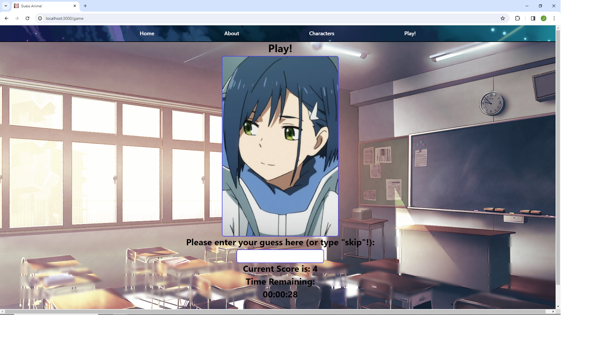
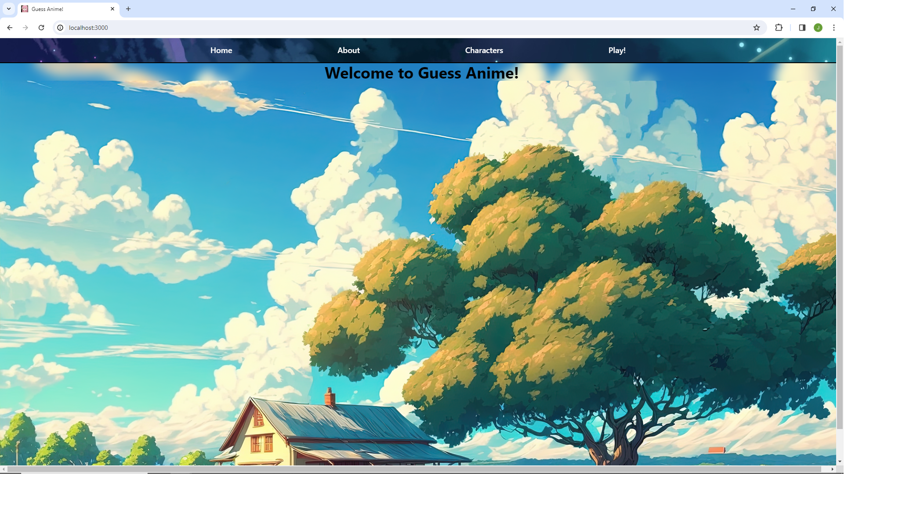
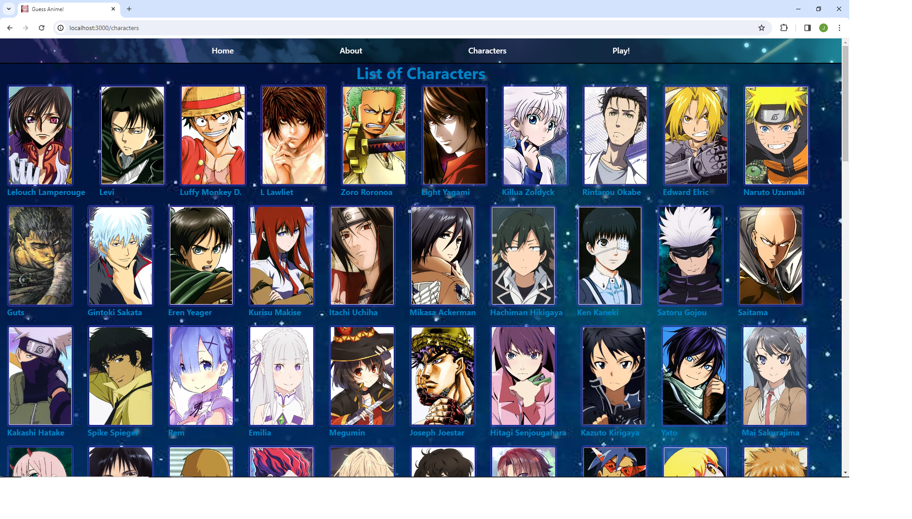

## Hello there!
## This application is a game created to practice development in React, it is a character guessing game.
## It is built using the MERN stack and REST API calls to a public API provided by the developer community for MAL.
## If you have any suggestions for either better game experience or implementation strategies, I would be more than happy to hear them!
## Below are some screenshots from the game:

##